# TUTORIAL INICIAR UN PROYECTO CON DJANGO 


## Iniciar proyecto

```bash
python -m django startproject introduccion
```

Con la anterior instrucción lo que estamos realizando es un nuevo proyecto en el que nos generara el código de un esqueleto básico de la creación de un proyecto.

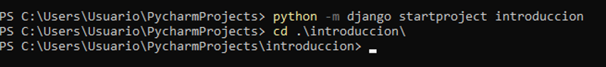

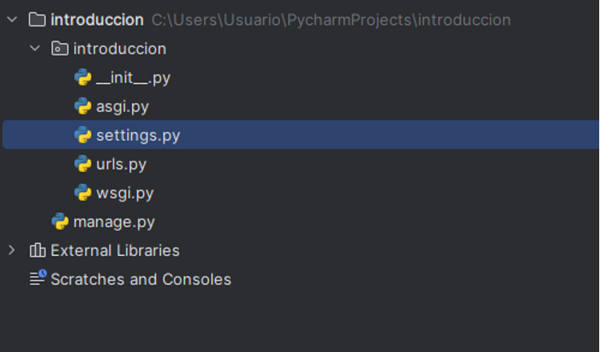


Podríamos decir que el archivo  setting.py es donde están todas las configuraciones del proyecto. Por ahora no tenemos una app para el modelo. El siguiente paso seria crearla.

```bash
python manage.py startapp pruebadb
```

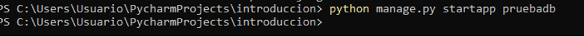

```bash
python manage.py runserver
```

Con la anterior instrucción desplegamos nuestro servidor local para realizar nuestras pruebas (nos vamos a centrar en el back por lo que vistas y demás lo dejamos para más adelante).

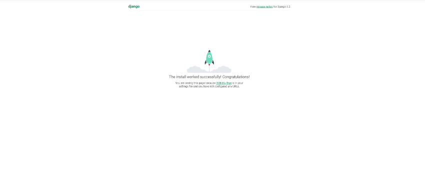

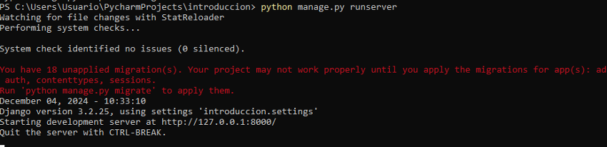

```bash
python manage.py migrate
```

Se generar las tablas por defecto que tiene django. 

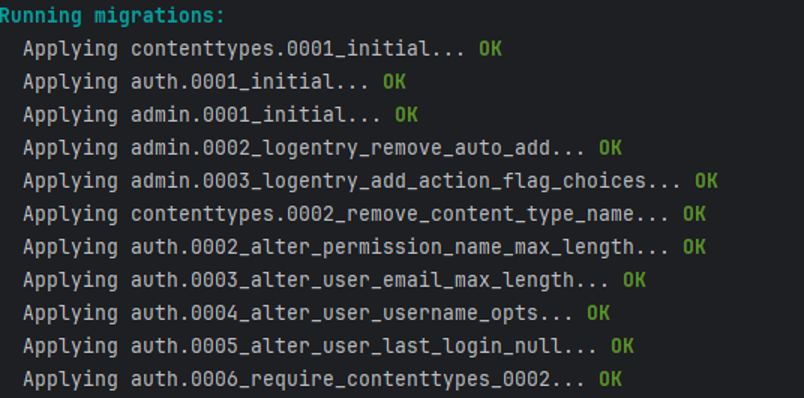

Hacer migraciones del modelo.
Para realizar las migraciones del modelo debe estar en el archivo setting del proyecto.


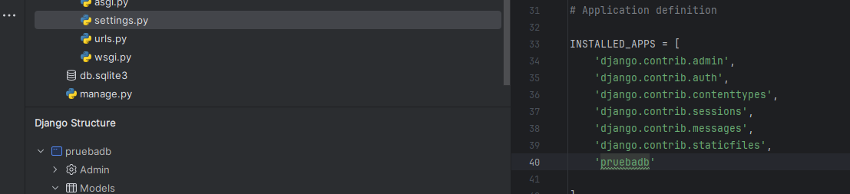

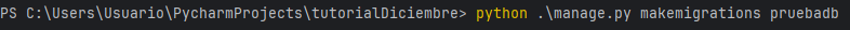

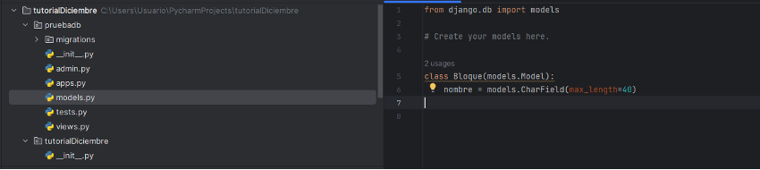

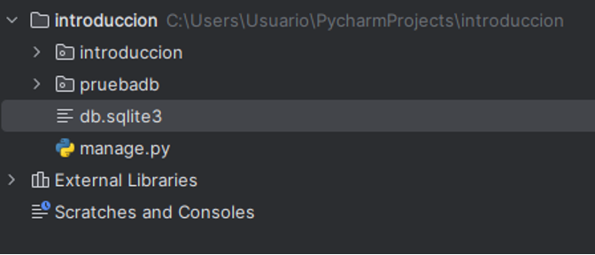

```bash
python manage.py createsuperuser
```

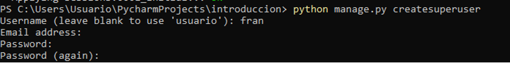

Si vamos al archivo urls.py vemos que tenemos /admin (accedemos a ella).

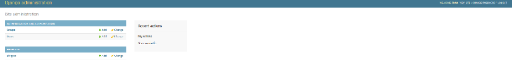

Si queremos que nuestros modelos puedan ser administrados debemos añadirlos al archivo de configuración.

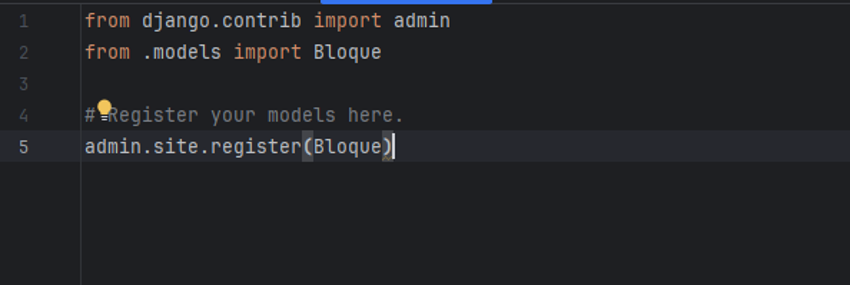

Podemos rellenar la tabla desde la administración

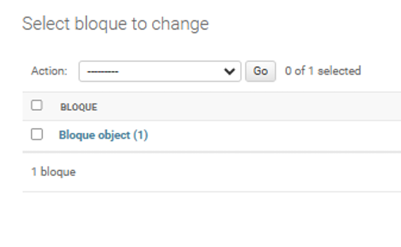

Si queremos que se muestre algo más que una simple referencia a memoria podemos sobreescribir el método __str__ (el toString de siempre)

[Variables en models](https://docs.djangoproject.com/en/5.1/ref/models/fields/)

[Proyecto de ejemplo](https://github.com/alion1992/djangoIntroduccion)